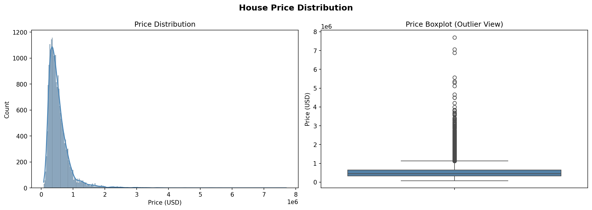
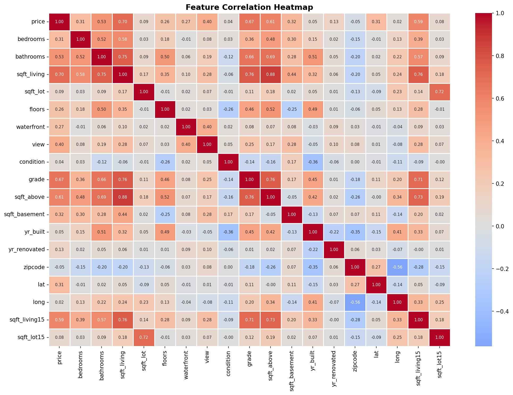
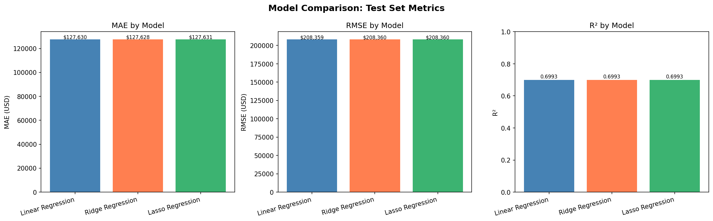
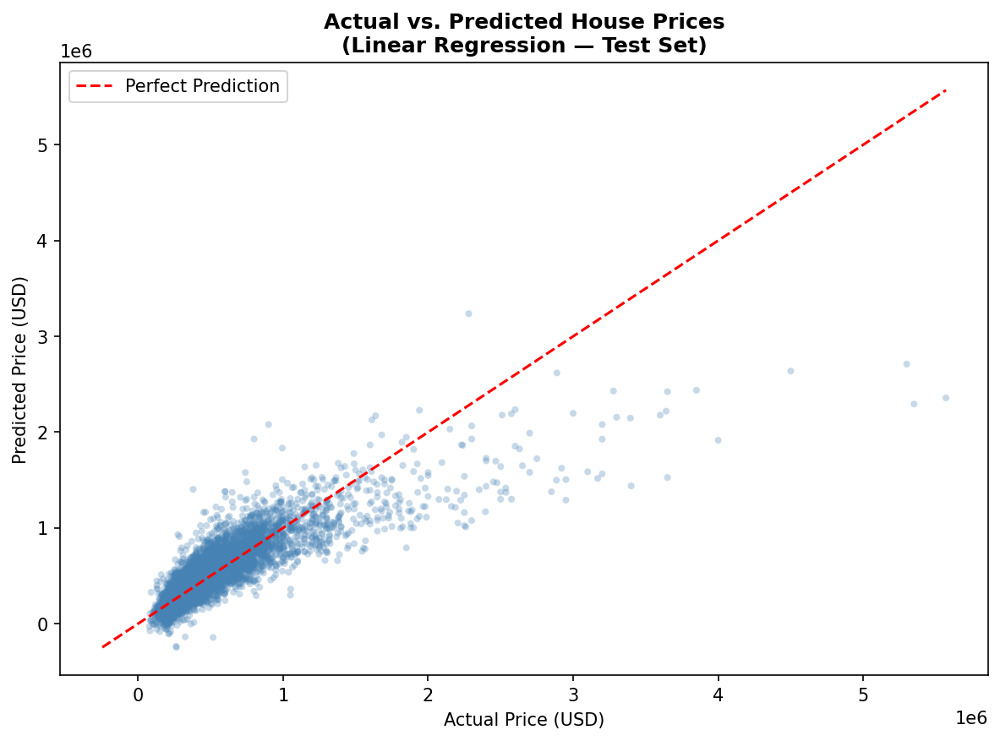
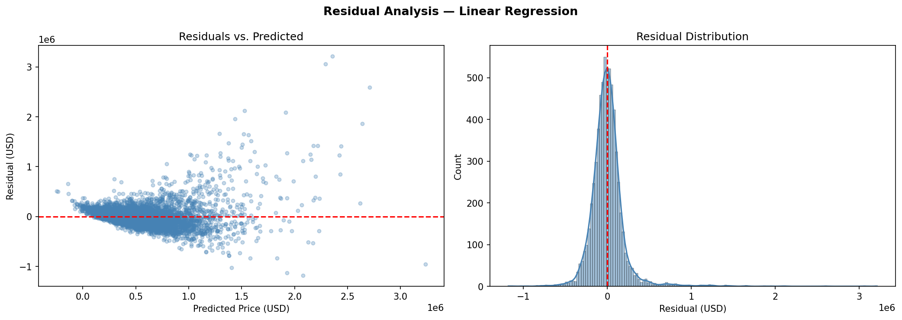
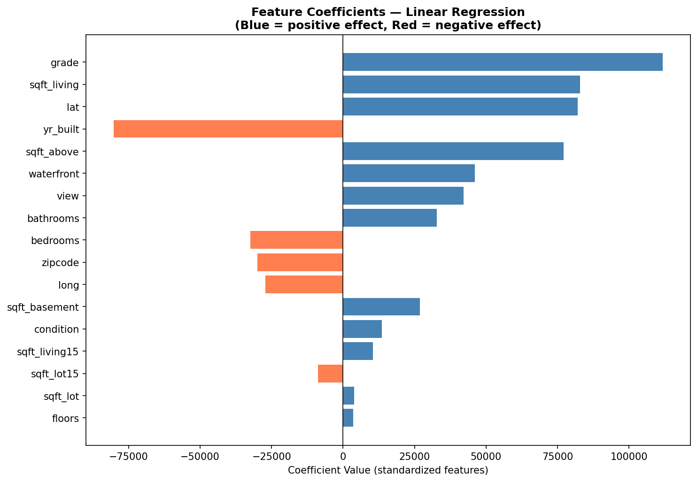

# End-to-End Machine Learning Regression: House Price Prediction

**Tech Stack:** Python · pandas · NumPy · scikit-learn · matplotlib · seaborn · Jupyter Notebook

[](https://www.python.org/)
[](https://scikit-learn.org/)
[]()

---

## Executive Summary

This project implements a complete end-to-end machine learning regression pipeline to predict residential house sale prices using structured property features. Three regression models — Linear Regression, Ridge Regression, and Lasso Regression — are trained, evaluated with 5-fold cross-validation, and compared using standard regression metrics.

All three models achieved comparable performance (R² ≈ 0.70), and Linear Regression was selected as the final model for its interpretability and transparency. The project demonstrates a full ML lifecycle from raw data to evaluated, interpretable predictions.

> **Google Colab version with outputs:**
> [View on Colab](https://colab.research.google.com/drive/1D2KW6PRKlAywEOpxbubHTz6Y5YUe--Dr?usp=sharing)

---

## Business Problem

Predicting house prices is a high-value regression problem with real-world applications in real estate, mortgage lending, and urban planning. Accurate price estimates help:

- **Buyers** assess affordability and make informed offers
- **Sellers** set competitive listing prices
- **Lenders** evaluate collateral risk when issuing mortgages
- **Analysts** identify market trends and pricing anomalies

**Task type:** Supervised regression  
**Target variable:** `price` (continuous — sale price in USD)  
**Primary challenge:** Balancing predictive accuracy with model interpretability and generalization to unseen data

---

## Dataset Overview

The dataset contains 21,613 residential property sale records from King County, WA (including Seattle), with 21 columns covering structural, locational, and quality attributes.

| Category | Features |
|---|---|
| Size & Structure | `bedrooms`, `bathrooms`, `sqft_living`, `sqft_lot`, `floors`, `sqft_above`, `sqft_basement` |
| Quality & Amenities | `waterfront`, `view`, `condition`, `grade` |
| Age | `yr_built`, `yr_renovated` |
| Location | `zipcode`, `lat`, `long` |
| Neighborhood | `sqft_living15`, `sqft_lot15` |

**Key data characteristics observed during EDA:**
- 0 missing values across all 21 columns
- Target (`price`) is right-skewed: mean ~$540K, median ~$450K, max $7.7M
- Strongest correlates with price: `sqft_living` (0.70), `grade` (0.67), `sqft_above` (0.61)
- Waterfront homes are rare (0.75% of records) but likely high-impact
- ~90% of homes have no view rating

---

## Learning Context

This project was completed while working through **"Mastering ChatGPT and Google Colab for Machine Learning"** by Moscato. The original notebook (`ML_Regression_Analysis_Model_github.ipynb`) follows a **chapter-based learning workflow** from the book:

- **Chapter 9** — Data preparation, EDA, feature analysis, and geospatial visualization
- **Chapter 10** — Model fine-tuning, cross-validation, model selection, and interpretability

The notebook preserves the instructional structure of the book, including textbook prompts and step-by-step commentary. It is intentionally kept as a learning artifact. A cleaned portfolio version (`notebooks/E2E_ML_Regression_Model_v2_clean.ipynb`) is also provided with improved structure and local file paths.

---

## Machine Learning Workflow

```
Raw Data → EDA → Feature Engineering → Train/Test Split → Scaling
    → Model Training → Cross-Validation → Evaluation → Model Selection → Interpretability
```

1. **EDA** — Distributions, correlations, outlier analysis, geospatial mapping
2. **Feature Engineering** — Drop non-predictive columns (`id`, `date`, `yr_renovated`)
3. **Train/Test Split** — 70% train / 30% test, `random_state=42`
4. **Scaling** — StandardScaler fit on training data only (no leakage)
5. **Model Training** — Linear, Ridge, and Lasso Regression
6. **Cross-Validation** — 5-fold CV on training set
7. **Evaluation** — MAE, MSE, RMSE, R² on held-out test set
8. **Model Selection** — Linear Regression selected based on CV evidence
9. **Interpretability** — Coefficient analysis on standardized features

---

## Exploratory Data Analysis

Key findings from EDA:

- **Price distribution** is right-skewed with significant outliers (max $7.7M). The mean ($540K) exceeds the median ($450K), indicating high-end homes pull the average upward.
- **sqft_living** shows the strongest linear relationship with price (correlation: 0.70)
- **grade** (construction quality) is the second strongest predictor (correlation: 0.67)
- **Bedroom count alone** is a weak predictor — living area matters more than room count
- **Geospatial clustering** confirms that location drives significant price variation

### Visuals





---

## Data Preprocessing

- Dropped `id` (identifier), `date` (not used in baseline), `yr_renovated` (mostly zeros)
- Retained `lat`, `long`, `zipcode` as location proxies
- Applied `StandardScaler` — fit on training data only, applied to both sets
- Scaling ensures coefficients are comparable across features with different units

---

## Model Training

Three models were selected to compare baseline performance against regularized alternatives:

| Model | Regularization | Purpose |
|---|---|---|
| Linear Regression | None | Interpretable baseline |
| Ridge Regression | L2 (shrinks all coefficients) | Handles multicollinearity |
| Lasso Regression | L1 (can zero out coefficients) | Implicit feature selection |

---

## Model Comparison

All three models produced nearly identical results across both the held-out test set and 5-fold cross-validation. This indicates that at default regularization settings, the feature set was already well-behaved after standardization.



---

## Model Evaluation

### Test Set Results (70/30 split, `random_state=42`)

| Model | MAE | RMSE | R² |
|---|---|---|---|
| Linear Regression | $127,630 | $208,359 | 0.6993 |
| Ridge Regression | $127,628 | $208,360 | 0.6993 |
| Lasso Regression | $127,631 | $208,360 | 0.6993 |

### 5-Fold Cross-Validation Results (Training Set)

| Model | CV MAE (mean) | CV MAE (std) | CV R² (mean) | CV R² (std) |
|---|---|---|---|---|
| Linear Regression | $125,059 | $515 | 0.6977 | 0.0112 |
| Ridge Regression | $125,056 | $515 | 0.6977 | 0.0112 |
| Lasso Regression | $125,059 | $515 | 0.6977 | 0.0112 |

**Metric interpretation:**
- **R² ≈ 0.70** — the model explains ~70% of variance in house prices
- **MAE ~$127K** — on average, predictions are off by about $127,000
- **Small CV std** — consistent performance across folds; model is stable
- **MSE is large** due to high-value outliers inflating squared errors

### Actual vs. Predicted



### Residual Analysis



The residual plot shows increasing spread at higher predicted prices (heteroscedasticity), which is a known limitation of linear models on right-skewed targets.

---

## Model Interpretability

Linear Regression was selected as the final model. Because features are standardized, each coefficient represents the change in predicted price for a **one standard deviation increase** in that feature.



**Interpretation guide:**
- **Positive coefficients** → feature increases predicted price
- **Negative coefficients** → feature decreases predicted price
- **Larger absolute value** → stronger influence on price

Top positive drivers: `grade`, `sqft_living`, `view`, `waterfront`  
Top negative drivers: `zipcode` (encodes location inversely in this encoding), `long`

---

## Limitations

- Linear models assume linear relationships between features and price — non-linear interactions are not captured
- Right-skewed price distribution inflates MSE; a log transformation of the target could improve this
- `zipcode` is treated as a raw numeric feature, which is not ideal — it should be encoded categorically or replaced with regional aggregates
- Regularization hyperparameters (`alpha`) were not tuned; GridSearchCV could improve Ridge/Lasso performance
- The model was not tested for temporal generalization (sale date was dropped)
- Residual heteroscedasticity suggests the model underperforms on high-value properties

---

## What I Learned

- Cross-validation provides more reliable performance estimates than a single train/test split — small CV standard deviations here confirm model stability
- When regularized models (Ridge, Lasso) perform identically to a baseline at default settings, it is evidence the feature set is already well-conditioned — not a reason to add complexity
- Interpretability is a genuine advantage in applied regression: standardized coefficients allow direct comparison of feature influence
- Regression metrics must be interpreted in context — an MAE of $127K is meaningful only relative to the price range ($75K–$7.7M)
- Geospatial analysis adds a dimension that purely numerical EDA misses

---

## How to Run This Project

### Option 1 — Run the cleaned v2 notebook locally

```bash
# Clone the repo
git clone https://github.com/ChieNwosu/E2E-Regression-Model.git
cd E2E-Regression-Model

# Install dependencies
pip install -r requirements.txt

# Launch the notebook
jupyter notebook notebooks/E2E_ML_Regression_Model_v2_clean.ipynb
```

The v2 notebook loads data from `data/raw/House_Prices.csv` and saves visuals to `visuals/`.

### Option 2 — View the original learning notebook on Google Colab

[Open in Colab](https://colab.research.google.com/drive/1D2KW6PRKlAywEOpxbubHTz6Y5YUe--Dr?usp=sharing)

The Colab version includes all cell outputs and follows the chapter-based structure from the textbook.

### Option 3 — Run the original notebook locally

```bash
jupyter notebook ML_Regression_Analysis_Model_github.ipynb
```

Note: The original notebook uses `google.colab` file upload cells that will not run outside Colab. Replace those cells with `pd.read_csv("House_Prices.csv")` for local execution.

---

## Portfolio Context

This regression project is part of a broader portfolio demonstrating proficiency across multiple areas of data science and machine learning:

| Project | Type | Skills Demonstrated |
|---|---|---|
| **This project** — House Price Prediction | Supervised Regression | EDA, preprocessing, model comparison, cross-validation, interpretability |
| [E2E Classification Model](https://github.com/ChieNwosu/E2E-Classification-Model) | Supervised Classification | Classification workflow, evaluation metrics, model selection |
| [AWS Consumer Complaint Intelligence Dashboard](https://github.com/ChieNwosu/aws-consumer-complaint-intelligence) | Cloud Analytics | AWS services, data pipelines, business intelligence |

Together, these projects reflect a consistent workflow across supervised learning paradigms and a growing focus on cloud analytics and responsible AI practices.

---

## Next Steps

- [ ] Tune Ridge and Lasso `alpha` hyperparameters using `GridSearchCV`
- [ ] Apply log transformation to `price` to reduce skewness and improve residual behavior
- [ ] Encode `zipcode` as a categorical feature or use regional price aggregates
- [ ] Explore non-linear models: Random Forest, Gradient Boosting (XGBoost/LightGBM)
- [ ] Perform formal residual diagnostics (Breusch-Pagan test for heteroscedasticity)
- [ ] Add a prediction interface — load the saved model and accept user input
- [ ] Explore feature interactions (e.g., `sqft_living × grade`)

---

## Project Structure

```
E2E-Regression-Model/
├── ML_Regression_Analysis_Model_github.ipynb  ← Original learning notebook (unchanged)
├── House_Prices.csv                           ← Original dataset (unchanged)
├── README.md                                  ← This file
├── README_original.md                         ← Backup of original README
├── requirements.txt                           ← Python dependencies
├── data/
│   └── raw/
│       └── House_Prices.csv                   ← Dataset copy for v2 notebook
├── notebooks/
│   └── E2E_ML_Regression_Model_v2_clean.ipynb ← Cleaned portfolio notebook
├── visuals/
│   ├── price_distribution.png
│   ├── correlation_heatmap.png
│   ├── actual_vs_predicted.png
│   ├── residual_plot.png
│   ├── model_comparison_metrics.png
│   └── coefficient_importance.png
└── docs/
    ├── project_overview.md
    ├── model_evaluation.md
    ├── model_interpretability.md
    ├── limitations.md
    └── stakeholder_summary.md
```
